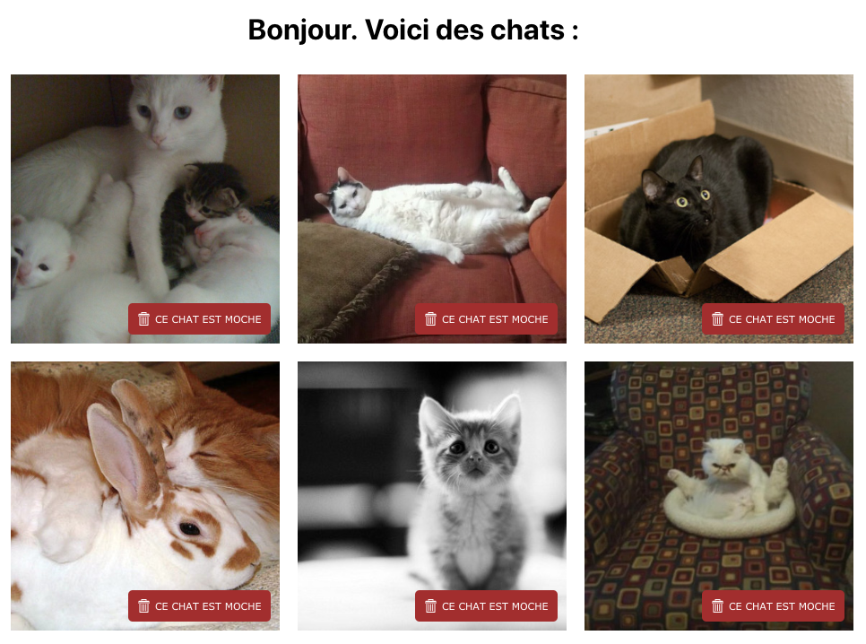

## Result

The project is a simple list of cats (fetched on each refresh).
You can choose to delete a picture if you don't like it by pressing the red button.

It looks like this :

This project was bootstrapped with [Create React App](https://github.com/facebook/create-react-app).

## Available Scripts

In the project directory, you can run:

`npm start`

To run the app in the development mode. 
Open [http://localhost:3000](http://localhost:3000) to view it in the browser.

This is a minimal boilerplate to help you start quickly with a React app

Packing, transpilation and all complicated stuff are being handled behind the scene
